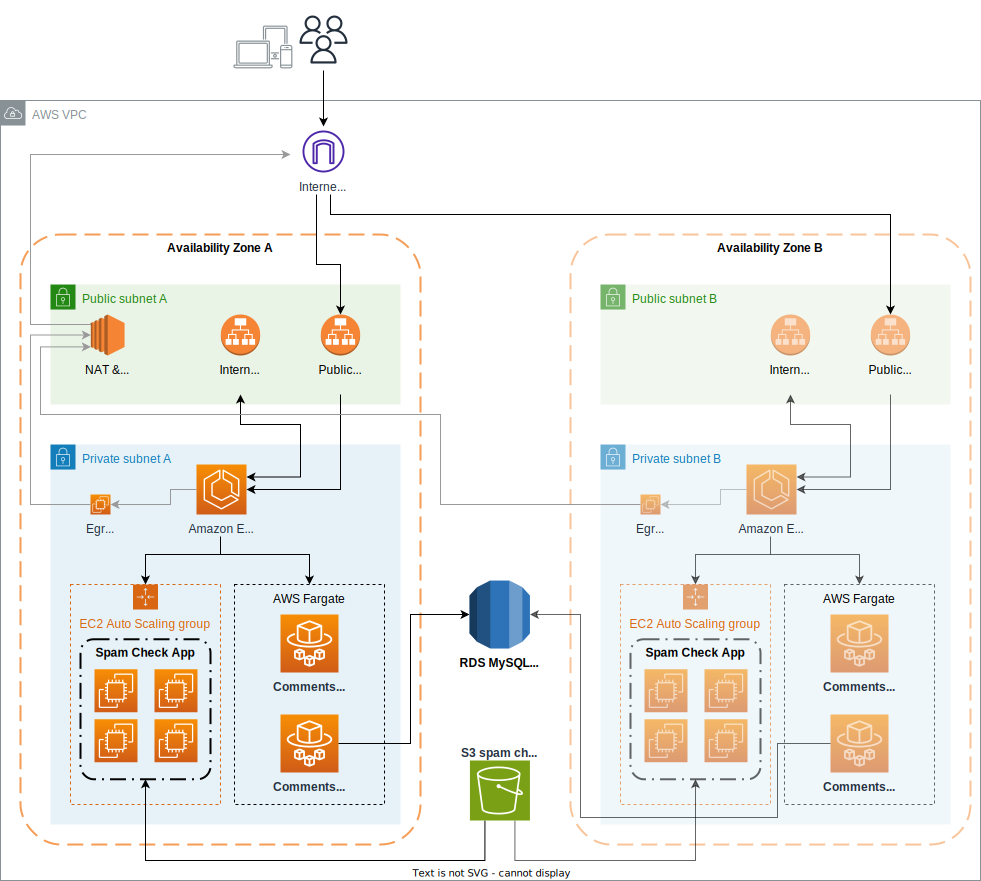
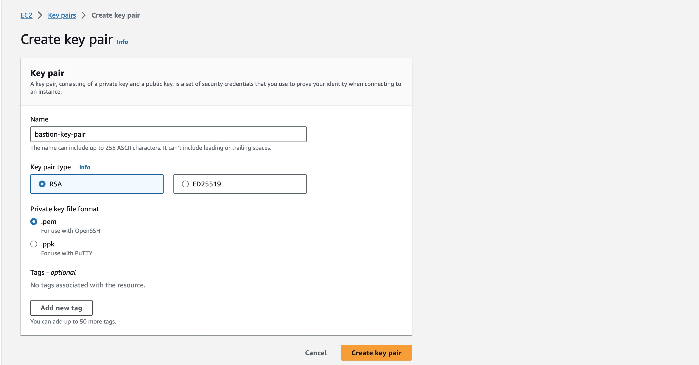
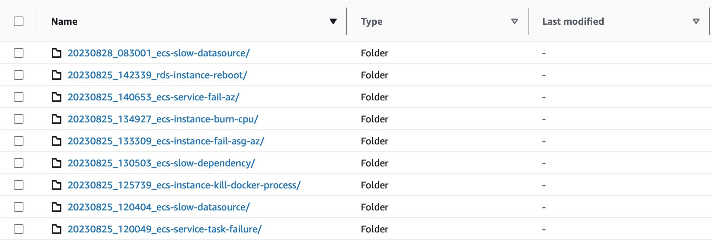

# Chaos Toolkit Starter Pack For AWS

A collection of real-world chaos engineering experiments for application infrastructures running on AWS, built using the popular open source framework [Chaos Toolkit][chaostoolkit].

## Concepts

Chaos Toolkit Starter Pack for AWS is a *template project* to accelerate the adoption of chaos engineering practices. The experiments in this project are created using [Chaos Toolkit][chaostoolkit], a simple and extensible framework for chaos engineering.

### Why Chaos Toolkit?

There are a number of chaos engineering frameworks available today, each with pros and cons. We decided to create the Starter Pack for AWS using Chaos Toolkit mainly because of its simplicity.

Implementing your first chaos engineering project is no easy feat. Especially at the beginning, engineers need to learn new techniques to inject faults into their systems, evaluate what works with their infrastructure and what does not. Chaos Toolkit comes with no additional overhead, the only requirements are Python and a few other command-line utilities and gives teams the freedom to build prototypes quickly.

### Project structure

> This is project is still under development so the project structure may be subject to change in future versions

```text
.
├── infrastructure/
├── library/
├── modules/
├── my-experiments/
├── Dockerfile
├── push_to_ecr.sh
├── requirements-dev.txt
├── requirements.txt
├── start-chaos.py
└── submit-job.py
```

* **infrastructure/**:
The `infrastructure/` directory contains the Terraform code to deploy the sample application into your own AWS infrastructure.

* **library/**:
The `library/` directory contains all Chaos Toolkit experiment examples provided with the starter pack.

* **modules/**:
The `modules/` directory contains Python modules that provide custom Chaos Toolkit activities and controls used by experiments.

* **my-experiments/**:
The `my-experiments/` directory is an empty placeholder to store user-created experiments.

* **Dockerfile**:
The Dockerfile used to bundle all templates, tools and modules into a single container image to run chaos experiments on AWS.

* **push_to_ecr.sh**:
A utility shell script to build and push the container to AWS ECR (Elastic Container Registry).

* **requirements.txt and requirements-dev.txt**:
List of Python requirements to execute and develop chaos experiments.

* **start-chaos.py**:
A Python wrapper for Chaos Toolkit CLI that facilitates variables configuration and reporting. For help see `./start-chaos.py --help`.

* **submit-job.py**:
A Python utility to submit a chaos experiment request to the AWS Batch environment queue. For help see `./submit-job.py --help`.

### How to find chaos experiments to run in the library

**Chaos Toolkit Starter Pack for AWS** comes with a library of reusable experiments that you can use to kick-start your chaos engineering project.

Experiments are organized in separate directories under the [library/](library/) directory and into categories. Every experiment in the library can be tested with the provided **comments-app** sample application.
Instructions on how to deploy **comments-app** into your AWS account are provided in the [Deploying the test infrastructure](#deploying-the-test-infrastructure) section.

Here is a list of available experiments:

```text
library
├── reliability
│   ├── ecs-instance-asg-fail-az
│   ├── ecs-instance-burn-cpu
│   ├── ecs-instance-kill-docker
│   ├── ecs-instance-termination
│   ├── ecs-service-fail-az
│   ├── ecs-service-slow-datasource
│   ├── ecs-service-slow-dependency
│   ├── ecs-service-tasks-failure
│   └── rds-instance-reboot
└── scalability
    ├── ecs-service-autoscaling
    ├── ecs-service-cpu-scaling
    ├── ecs-service-max-capacity-alarm
    ├── ecs-service-scale-in
    └── ecs-service-scale-out
```

Experiment directories are named using the following convention: `[aws-resource-type]-[fault-type]`. This way it's easier to understand what a test is about without having to look at the code.

For instance, the `reliability/ecs-instance-burn-cpu` will introduce a CPU stressor (*burn-cpu*) to ECS instances (*ecs-instance*).

### Experiments structure

Even though Chaos Toolkit experiments don't need to follow project conventions, we think introducing some consistent structure in the way we organize experiment files can help avoid issues as we add more experiments and configuration files.

Every experiment in the **Chaos Toolkit Starter Pack for AWS** library will follow a structure similar to this:

```text
library/path/to/experiment/
├── README.md
├── experiment.conf
├── experiment.yaml
├── variables.yaml              (Optional)
└── variables-<context>.yaml    (Optional)
```

#### Experiment documentation
Each experiment is stored in its separate directory alongside its configuration files and the **README.md** file.
Special emphasis on the latter as it's incredibly important to provide documentation for every experiment template, to describe what it does, how it should be used and available configuration options.

#### Template definition
The `experiment.yaml` and `experiment.conf` contain respectively the Chaos Toolkit template definition and the config file to feed the `start-chaos.py` wrapper script. As we only have one experiment in every folder using the name *experiment.yaml* by convention should reduce "name hunting" when we run experiments from the terminal.

#### Experiment variables
Supplying a lot of overrides via command-line arguments is error-prone and should be avoided. For this reason, **we use external configuration files for experiments with lots of variables**.

Chaos Toolkit supports storing collection of variables in *JSON* or *YAML* files that can be passed to experiments using the `--var-file <file>` command-line argument.

This is, in essence, how we provide values for Chaos Toolkit variables:

* Default variable values are provided directly in the experiment template. This values are typically defaults used during development.
* Global overrides are stored in the experiment folder in the `variables.yaml` (or `.json`) file. Variables in this file should always be used to run experiments against target environments.
* Environment-specific (or **context-specific**) overrides are stored in files called `variables-<context>.yaml`, suffixed by the context name.

## Setting up locally

### Setup the Python interpreter and Pip

Chaos Toolkit is a Python application and needs the Python interpreter to run. Most systems today have a Python version pre-installed.

To verify if the `python` interpreter and `pip` are already available in your system, run the following commands using your terminal:

```shell
python --version
# Python 3.11.5

pip --version
# pip 23.1 from /Users/manuel/.pyenv/versions/3.11.3/lib/python3.11/site-packages/pip (python 3.11)
```

Any Python version `>=3.7` should be fine to run Chaos Toolkit. In case the commands above return and error you need to install a Python version in your system.

Depending on the operating system you're running on the installation process may be different.

**On Windows**:

You can download the Python binary installer from the [official website](https://www.python.org/downloads/windows/).

**On MacOS X**:
```shell
brew install python3
```

**On Debian/Ubuntu**:
```shell
sudo apt-get install python3 python3-dev
```

After following the installation steps, verify that Python and Pip have been correctly installed using the `python --version` and `pip --version` commands described above.


### Create a new virtual environment

A Python **virtualenv** is a self-contained Python installation created from the existing Python environment (known as the *base* environment). The main benefit of using a virtual environment instead of the base Python installation is being able to create a separate space where all our project dependencies will live.

To create a new virtual environment we need to install the `virtualenv` package with `pip`:

```shell
pip install -U virtualenv
```

After the installation is complete, we create a new virtualenv in the `./venv/` directory:

```shell
python -m venv ./venv/
```

The command above, will create a new folder in your current directory called `venv/` that contains the Python binaries and all additional packages we install.

> IMPORTANT: your system will not use the Python virtualenv by default. We need to activate the virtual environment in `./venv/` before we can use it!

Every time we open a new terminal window, we need to tell our terminal to use the virtual environment instead of the base Python interpreter. To do so we use the `activate` utility script provided with the virtualenv:

**On Windows**:
```shell
venv/Scripts/activate.bat
```

**On MacOS X**:
```shell
source venv/bin/activate
```

### Install Python requirements

All project requirements and development requirements are stored in respectively the `requirements.txt` and `requirements-dev.txt` files.
Installing the packages listed in the `requirements.txt` is sufficient for executing experiments both locally and on the AWS Batch compute environment.

Use the following command to install all packages from a requirements file:
```shell
pip install -r requirements.txt
```

To verify the requirements installation was successful, check if the Chaos Toolkit CLI is available in your virtual environment:
```shell
chaos --version
# chaos, version 1.15.1
```

## Installing additional dependencies
Some of the chaos experiments provided with *ChaosToolkit Starter Pack for AWS* require additional dependencies to run. If that's the case, the experiment's `README` file will provide a list of additional software required to run.

### Terraform and Terragrunt

**ChaosToolkit Starter Pack for AWS** uses [Terraform][terraform] and [Terragrunt][terragrunt] to provision the infrastructure for the sample application and run experiments.

* [Install Terraform](https://developer.hashicorp.com/terraform/downloads)
* [Install Terragrunt](https://terragrunt.gruntwork.io/docs/getting-started/install/)

### AWS CLI

* [Install the AWS CLI V2](https://docs.aws.amazon.com/cli/latest/userguide/getting-started-install.html)

### Grafana K6

**Grafana K6** is a load generation tool and required by the `chaostoolkit-grafana` Python extension for Chaos Toolkit. Follow the instructions in the [Official Grafana documentation](https://k6.io/docs/get-started/installation/) to install `k6` in your machine.

* [Install Grafana K6](https://k6.io/docs/get-started/installation/)

### AWS Fail AZ

**aws-fail-az** is a Go program that simulates AZ (Availability Zone) failures on AWS resources. To install this tool, follow the installation instructions provided in the project's homepage:

* [Install `aws-fail-az`](https://github.com/mcastellin/aws-fail-az#readme)


## Deploying the test infrastructure

**ChaosToolkit Starter Pack for AWS** comes with a sample application infrastructure you can deploy on your own AWS account. It provides a microservices application called `comments-app` that can store users' comments for blog posts and articles.

The sample infrastructure will deploy three microservices into AWS ECS (Elastic Container Service):

* **comments-web**: the web layer exposes the application API to the Internet. It's a Nodejs application and its role is providing a consistent API interface to the public by forwarding incoming requests to the `comments-api` microservice
* **comments-api**: the core microservice of the application written in Java. It stores information about *users*, *posts* and *comments* into an RDS database
* **comments-spamcheck**: a Python microservice that uses a pre-trained machine learning model to filter offensive comments automatically

To provide different types of deployment to experiment with, some microservices are provisioned using AWS Fargate, while other are deployed on an ECS Cluster with EC2 capacity providers.

Find below an **overview of the application architecture provided**:



### Provision the application in your AWS account

We use **Terraform** and **Terragrunt** to automate the application infrastructure deployment. All provided infrastructure code is located under the `infrastructure/` folder in this project.

```text
infrastructure/
├── README.md
├── comments-app/
│   ├── networking/
│   ├── services/
│   └── terragrunt.hcl
└── submodules/
    ├── compute-environment/
    └── ecs-cluster-ec2-provider/
```

The Terraform code that creates the app infrastructure is organized in different modules and tied together using Terragrunt. The `terragrunt` CLI will allow us to deploy the entire application stack using a single command.

To deploy the infrastructure, first locate your AWS Account ID from the [AWS Console](http://console.aws.amazon.com) and export it as a variable in your current terminal together with the AWS Region and CLI profile (if different from default):

```shell
export AWS_ACCOUNT_ID=XXXXXXXXXXXX
export AWS_REGION=us-east-1
export AWS_PROFILE=default
```

Once you set the required environment variables, navigate to the `infrastructure/comments-app/` directory and use *Terragrunt* to apply all infrastructure modules:

```shell
cd infrastructure/comments-app/

terragrunt run-all apply
# INFO[0000] The stack at infrastructure/comments-app will be processed in the following order for command apply:
# Group 1
# - Module infrastructure/comments-app/networking
# 
# Group 2
# - Module infrastructure/comments-app/services
# 
# Are you sure you want to run 'terragrunt apply' in each folder of the stack described above? (y/n)
#
# <-- reply `y`
```

> Provisioning the whole infrastructure takes approximately ~20 minutes as the creation of certain resources like RDS databases and Application Load Balancers can take some time.

### Customize the "comments-app" infrastructure

We use the `terragrunt.hcl` file to configure the infrastructure deployment.
You can customize your deployment by editing the `infrastructure/comments-app/terragrunt.hcl` file to provide additional *Terraform variables*. 

For instance, you can open a remote shell into the *bastion instance* created by Terraform to access AWS resources located in private subnets, like private ECS services or other EC2 instances.
To do so, you first need to configure the name of your own **ssh-key-pair** in the `terragrunt.hcl`.

If you don't already have an *ssh-key-pair* in your AWS account, you can create a new one under **EC2 > Network & Security > Key Pairs > Create key pair**, enter a name for the new key pair, for example *bastion-key-pair*, click **Create key pair** and download the `.pem` file.



Next, edit the `infrastructure/comments-app/terragrunt.hcl` file and **locate or add the `bastion_key_pair_name` variable in the `inputs = {...}` section** to set our bastion ssh-key-pair name:

```terraform
# terragrunt.hcl

inputs = {
  ...

  ## Enables remote connection to bastion server
  ## If you want to enable remote connection into the infrastructure, uncomment the line below
  ## and insert your bastion ssh-key-pair name.
  #
  bastion_key_pair_name = "bastion-key-pair"
}
```

Once you're happy with the new configuration, run the `terragrunt` command again to apply the new changes:

```shell
cd infrastructure/comments-app/

terragrunt run-all apply
```

### How to destroy the app infrastructure after use

We do our best to minimize the impact the sample infrastructure will have on your AWS bill, but to contain costs it's best if you destroy the resources after you are done using them.
To destroy all resource we again use *Terragrunt*:

```shell
export AWS_ACCOUNT_ID=XXXXXXXXXXXX
export AWS_REGION=us-east-1
export AWS_PROFILE=default

cd infrastructure/comments-app/

terragrunt run-all destroy
# INFO[0000] The stack at infrastructure/comments-app will be processed in the following order for command destroy:
# Group 1
# - Module infrastructure/comments-app/services
# 
# Group 2
# - Module infrastructure/comments-app/networking
# 
# Are you sure you want to run 'terragrunt destroy' in each folder of the stack described above? There is no undo! (y/n)
#
# <-- reply `y`
```

## Running experiments locally with Chaos Toolkit CLI

Once you deployed the sample *comments-app* into your AWS account, you can run the experiments in the **chaos experiments library** using Chaos Toolkit CLI.

As we discussed in previous sections, the `library/` directory contains a collection of Chaos Toolkit experiments that can be executed against the sample *comments-app* application. For this example, we will run the **reliability/ecs-instance-termination/** experiment using Chaos Toolkit.

### Prerequisites

To run any experiment from the **ChaosToolkit Starter Pack for AWS** library, we first need to ensure that:
* the AWS credentials and region are set in our session
* the Python environment is configured to run Chaos Toolkit experiments

To set our AWS environment we make sure the *AWS_REGION* and *AWS_PROFILE* variables are set:
```shell
export AWS_REGION=us-east-1
export AWS_PROFILE=default
```

Then, we activate the Python virtual environment and set the *PYTHONPATH* variable so all Python modules in the `modules/` directory are discoverable:

```shell
source ./venv/bin/activate
export PYTHONPATH=$(pwd)/modules
```

> IMPORTANT! Make sure your *PYTHONPATH* points to the `modules` directory in the root of this repository. To check the variable's current value run `echo $PYTHONPATH`.

### Run the experiment template using the chaos CLI

Every experiment you can find in the library has a **README.md** file to describe what the experiment does, additional requirements and run instructions.

Open the `library/reliability/ecs-instance-termination/README.md` file and locate the run instructions provided in the *Running The Experiment* section.

As indicated by the instructions, we can now launch the experiment by moving into the experiment folder and using the suggested `chaos` command:

```shell
cd library/reliability/ecs-instance-termination/
chaos run \
    --rollback-strategy always \
    experiment.yaml
```

### Override experiment configuration using the chaos CLI

Experiments offer several customization options using the Chaos Toolkit configuration. To modify the behaviour of an experiment we can override configuration values using the `--var` command line argument:

```shell
# override experiment's stress_user and stress_duration_seconds
chaos run \
    --rollback-strategy always \
    --var 'stress_user:int=10' \
    --var 'stress_duration_seconds:int=120' \
    experiment.yaml
```

For more information, see the [Chaos Toolkit official documentation][ctk-run-docs].


## Running experiments using the `start-chaos.py` wrapper script

Running chaos experiments with the Chaos Toolkit CLI is absolutely fine, but maintaining variable overrides to use in different contexts or environments can quickly become unmanageable if we don't find a way to organize them.

Chaos Toolkit offers the ability to store collections of environment overrides into *JSON* or *YAML* files. This is perfect for handling variables, though we still have to remember additional configuration options like *rollback and hypothesis strategies* or *settings files*.

To address these concerns, we created a *wrapper script* called `start-chaos.py` to allow users to structure their experiment variables and settings in a single configuration file.

```shell
python start-chaos.py --help
# Usage: start-chaos.py [OPTIONS] CONFIG_FILE
# 
#   Cli to start a chaos experiment from a configuration definition
# 
# Options:
#   -v, --verbose           Display debug level traces.
#   --context TEXT          The execution context for the experiment
#   --journals-bucket TEXT  The S3 bucket to upload journal files after
#                           experiment execution
#   --help                  Show this message and exit.
```

### The experiment configuration file for the wrapper script

Using the `start-chaos.py` wrapper script we can define how our experiment should run in a single configuration file. The structure of the config file is the following:

```text
[DEFAULT]
experiment_path = ec2-instance-failure.yaml
hypothesis_strategy = continuously
hypothesis_frequency = 120
fail_fast = true

# Specific configuration for development context
[development]
var_overrides = 
    environment             = dev
    stress_duration_seconds = 120
    stress_users            = 10

# Specific configuration for test context
[test]
var_overrides = 
    environment             = test
    stress_duration_seconds = 900
    stress_users            = 70


# Specific configuration for production context
[live]
var_files = variables.yaml, variables-live.yaml
```

To break down the sections in the configuration file we have:

**[DEFAULT]**: this config section contains properties that will always be applied, regardless of the experiment *context*

**[<section_name>]**: every additional section will represent a **context** in which we run chaos experiments. For instance we might need to run an experiment for just a few minutes on a *development* environment and specify a longer duration when using the *live* context

Every section in this file (other than the *DEFAULT*) is mutually exclusive, meaning that if we run an experiment in a *live* context we will not inherit configurations that are specific for any other context.

### How to run the experiment with the wrapper script

Every experiment in the Starter Pack library has its own `experiment.conf` file that can be used with the wrapper.

To start an experiment from a `*.conf` file we can use the following command *from the project's root directory*:

```shell
python start-chaos.py path/to/experiment.conf
```

By default the `start-chaos.py` will use the *DEFAULT* context. To run experiments with a different set of configurations we can use the `--context` argument:

```shell
python start-chaos.py \
    --context live \
    path/to/experiment.conf
```

### Additional features of the wrapper script

In addition to running experiments, the `start-chaos.py` offers the following additional features:

#### Automated upload of experiment journal and logs to S3 bucket

This feature is disabled by default but can be activated by setting either the `--journals-bucket` argument or the `CHAOS_JOURNALS_BUCKET` environment variable:

```shell
python start-chaos.sh \
    --journals-bucket $AWS_ACCOUNT_ID-persistent-journals-bucket \
    path/to/experiment.conf

# or, alternatively with env variable

export CHAOS_JOURNALS_BUCKET=${AWS_ACCOUNT_ID}-persistent-journals-bucket
python start-chaos.sh path/to/experiment.conf
```

As a result, experiments *journal.json* and *chaostoolkit.log* files will be stored in a new directory in the specified bucket:



The directory name will be the formatted time stamp of the **experiment start time** plus the sanitized experiment **title**.


[chaostoolkit]: https://chaostoolkit.org
[terraform]: https://www.terraform.io/
[terragrunt]: https://terragrunt.gruntwork.io/
[ctk-run-docs]: https://chaostoolkit.org/reference/usage/run/
